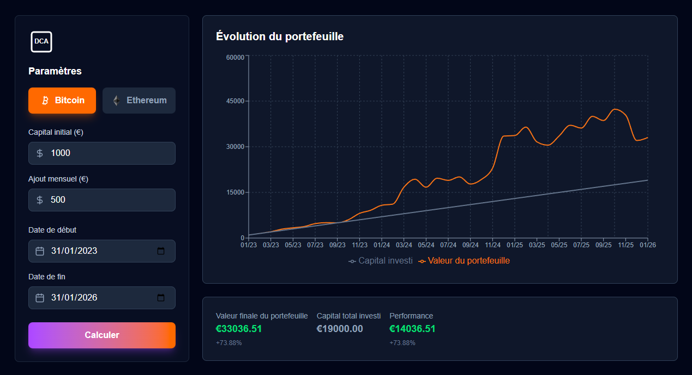

# DCA Crypto Calculator

A modern web application to simulate Dollar Cost Averaging (DCA) strategies for Bitcoin and Ethereum investments.

## Features

- **Interactive DCA Simulation**: Calculate and visualize investment returns using Dollar Cost Averaging
- **Multi-Cryptocurrency Support**: Analyze strategies for both Bitcoin and Ethereum
- **Historical Data**: Uses real market data from the past years for accurate simulations
- **Responsive Design**: Clean, dark-themed interface that works on all devices
- **Real-time Charts**: Visualize your investment growth over time with interactive charts

## Tech Stack

- **Framework**: Next.js 16 (App Router)
- **Styling**: Tailwind CSS
- **Charts**: Recharts
- **Icons**: Lucide React
- **API**: CryptoCompare API for historical crypto prices

## Getting Started

1. Clone the repository:
```bash
git clone https://github.com/your-username/dca-crypto-calculator.git
cd dca-crypto-calculator
```

2. Install dependencies:
```bash
npm install
```

3. Set up your environment variables by creating a `.env.local` file:
```bash
CRYPTOCOMPARE_API_KEY=your_api_key_here
```

4. Run the development server:
```bash
npm run dev
```

5. Open [http://localhost:3000](http://localhost:3000) in your browser.

## Usage

1. Select your cryptocurrency (Bitcoin or Ethereum)
2. Set your initial capital amount
3. Define your monthly investment amount
4. Choose your investment period (start and end dates)
5. Click "Calculate" to see your DCA strategy results
6. Review the chart and summary metrics

## Screenshots



## Contributing

Contributions are welcome! Please feel free to submit a Pull Request.

## License

This project is open source and available under the [MIT License](LICENSE).</content>
<parameter name="filePath">D:\Github\dca-crypto-calculator\README.md